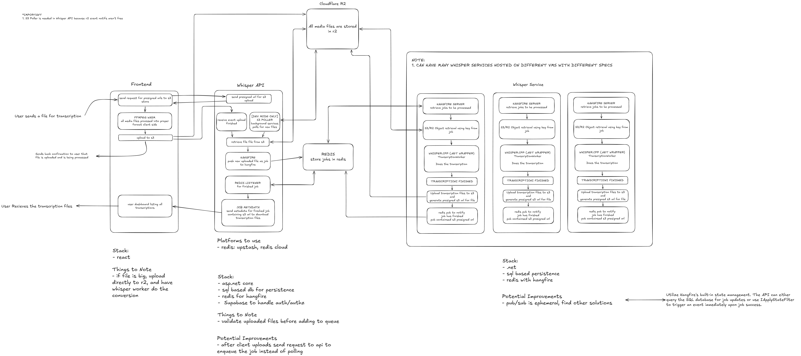

# WordScribe Backend

WordScribe is a scalable, distributed audio transcription backend built using **.NET 10**, designed to process media files using **Whisper.net** (a C# wrapper for whisper.cpp). It features a decoupled architecture composed of an ASP.NET Core Web API and autonomous Whisper Worker Services orchestrated via **Hangfire** and **Redis**.



---

## Architecture Overview

The system architecture is designed for high scalability, allowing multiple Whisper worker instances to be deployed on different machines (with varying CPU/GPU capabilities) to consume transcription jobs concurrently.

```
                  ┌──────────────────────┐
                  │       React UI       │
                  └──────────┬───────────┘
                             │ (1) Request Presigned URL
                             ▼
 ┌──────────┐     ┌──────────────────────┐
 │          │◄────┤  ASP.NET Core Web API│
 │          │ (2) └──────────┬───────────┘
 │          │     Send       │ (3) Enqueue
 │Cloudflare│     Presigned  │     Job
 │  R2 /    │     URL        ▼
 │  AWS S3  │     ┌──────────────────────┐
 │          │◄────┤  Hangfire + Redis    │
 │          │ (5) └──────────┬───────────┘
 │          │     Download   │ (4) Pull Job
 │          │     & Upload   ▼
 │          │     ┌──────────────────────┐
 │          │◄────┤Whisper Worker Service│
 └──────────┘     └──────────────────────┘
```

### Flow of Data:
1. **Upload Request**: The client requests a presigned upload URL from the Web API.
2. **Direct Upload**: The client uploads the audio/video file directly to **Cloudflare R2 / S3** storage using the presigned URL.
3. **Queue Job**: The API enqueues a transcription job to **Redis** using **Hangfire**.
   - *Note*: In Development Mode, a background poller (`S3 Poller`) can monitor the bucket for uploads (since Cloudflare R2 bucket event notifications can be costly).
4. **Retrieve & Process**: An available **Whisper Worker Service** pulls the job from Hangfire, downloads the target media file from R2/S3, and runs it through the local **Whisper.net** engine.
5. **Save & Notify**: The worker uploads the completed transcription file back to R2/S3, generates a presigned download URL, and notifies the client (via Redis pub/sub or Hangfire state change filters).

---

## Project Structure

The projecti structured following a Clean Architecture approach:

*   **Api.Web**: ASP.NET Core Web API entrypoint. Handles user authentication (via Supabase), generates presigned storage URLs, enqueues jobs, and manages transcription metadata.
*   **Api.Application** & **Api.Domain**: Houses the API's core business logic, domain models, and application workflows.
*   **WhisperService.WorkerService**: A .NET Worker Service running a Hangfire server instance to process queued jobs using the Whisper engine.
*   **WhisperService.Core** & **WhisperService.Infrastructure**: Implements transcription-specific components, including the Whisper engine wrapper and runtime logic.
*   **ModelDownloader**: A utility CLI application to download pre-trained GGML Whisper models (e.g. Tiny, Medium, LargeV3Turbo) directly from HuggingFace/GitHub.
*   **Shared Modules**:
    *   **Shared.Abstractions**: Common interfaces and abstract contracts (e.g., storage, jobs, services).
    *   **Shared.Contracts**: Data transfer objects (DTOs) and application-wide constants (languages, model options).
    *   **Shared.Infrastructure**: Shared cross-cutting concerns such as AWS S3 clients, Hangfire Redis storage setup, and configuration options.

---

## Tech Stack

*   **Runtime**: .NET 10
*   **Queue & Orchestration**: Hangfire with Redis (`Hangfire.Redis.StackExchange`)
*   **Transcription Engine**: Whisper.net (utilizing whisper.cpp runtimes)
*   **Storage**: Cloudflare R2 / AWS S3 compatibility via `AWSSDK.S3`
*   **Database**: SQL-based database for persistence